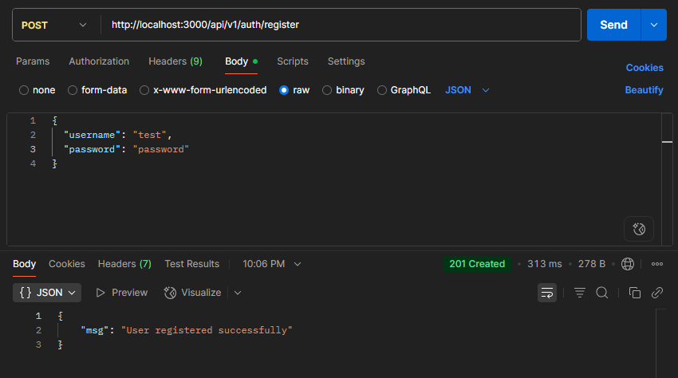
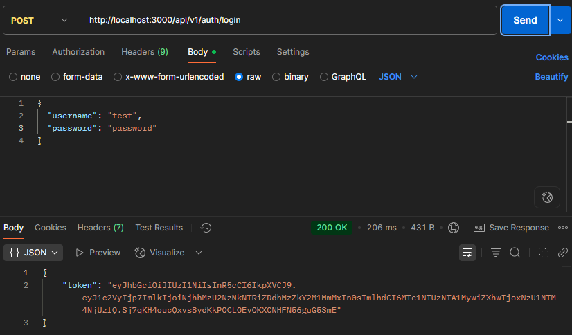
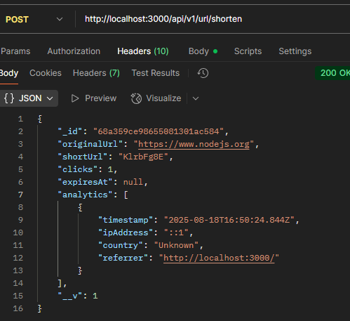
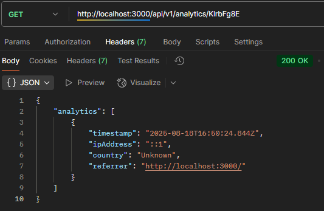

## URL Shortener

This is a full-featured URL shortener back-end application built with Node.js and Express.js. It allows users to create short, unique links that redirect to long URLs. The project demonstrates essential back-end concepts such as API design, database operations, and user authentication, making it a robust portfolio piece.

#### **Live Demo**: [https://url-shortener-l4wb.onrender.com](https://url-shortener-l4wb.onrender.com)
-----

### Key Features

  * **URL Shortening**: Converts a long URL into a short, unique alias.
  * **Redirection**: Automatically redirects users from the short URL to the original long URL.
  * **User Authentication**: Utilizes JSON Web Tokens (JWT) to secure premium features for registered users.
  * **Analytics**: Tracks and provides data on the number of clicks for each shortened link.
  * **Redis Caching**: Caches frequently accessed URLs to improve redirection performance.
  * **Expiry Option**: Allows users to set an optional expiration date for their shortened links.

-----

### Technologies Used

  * **Node.js**: The JavaScript runtime environment.
  * **Express.js**: The web application framework for building the server.
  * **MongoDB**: The NoSQL database for storing URL and user data.
  * **Mongoose**: An ODM (Object Data Modeling) library for interacting with MongoDB.
  * **Redis**: An in-memory data store used for caching.
  * **JSON Web Token (JWT)**: Used for stateless user authentication.
  * **bcrypt**: A library for hashing user passwords securely.

-----

### Screenshots
#### Postman
### Register API Test
  

### Login API Test  
  

### URL Shortening API Test  
  

### Analytics Response  
  

### Setup and Installation

1.  **Clone the repository:**

    ```bash
    git clone https://github.com/your-username/url-shortener.git
    cd url-shortener
    ```

2.  **Install dependencies:**

    ```bash
    npm install
    ```

3.  **Set up environment variables:**
    Create a `.env` file in the project root with the following variables, replacing the placeholders with your own values.

    ```ini
    MONGO_URI=your_mongodb_connection_string
    PORT=3000
    JWT_SECRET=your_jwt_secret_key
    REDIS_URL=your_redis_connection_string
    ```

4.  **Start the server:**

    ```bash
    npm run dev
    ```

    The server will start on `http://localhost:3000`.

-----

### API Endpoints

All API endpoints are prefixed with `/api/v1`.

#### **Authentication**

  * `POST /api/v1/auth/register`

      * **Description**: Creates a new user account.
      * **Body**: `{ "username": "test", "password": "password" }`

  * `POST /api/v1/auth/login`

      * **Description**: Authenticates a user and returns a JWT.
      * **Body**: `{ "username": "test", "password": "password" }`

#### **URL Shortening (Protected)**

  * `POST /api/v1/url/shorten`
      * **Description**: Creates a new short URL. Requires a valid JWT.
      * **Headers**: `x-auth-token: <your-jwt>`
      * **Body**: `{ "originalUrl": "https://www.nodejs.org" }`

#### **URL Redirection**

  * `GET /<shortUrl>`
      * **Description**: Redirects to the original URL.
      * **Example**: `GET http://localhost:3000/KlrbFg8E`

#### **Analytics (Protected)**

  * `GET /api/v1/analytics/<shortUrl>`
      * **Description**: Retrieves click analytics for a specific short URL. Requires a valid JWT.
      * **Headers**: `x-auth-token: <your-jwt>`

-----

### File Structure
```
/url-shortener
├── /middleware
│   └── auth.js
├── /models
│   ├── User.js
│   └── Url.js
├── /public
│   └── index.html
├── /pictures
├── /routes
│   ├── analytics.js
│   ├── auth.js
│   ├── redirect.js
│   └── url.js
├── .env
├── .gitignore
├── db.js
├── index.js
├── LICENSE
├── package.json
├── package-lock.json
├── README.md
└── redisClient.js
```


### Future Enhancements

  * Adding a front-end interface for users to manage their URLs.
  * Implementing user-friendly dashboards to view analytics data.
  * Adding support for custom short URLs. 
